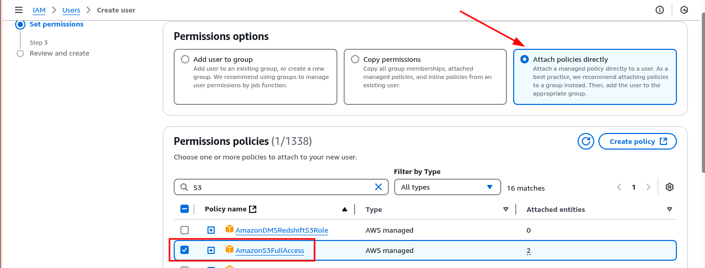

# Deploying a Hugo Static Website to AWS S3 and Cloudflare Using Pulumi

<p align="center">
  
</p>

This project demonstrates how to deploy a Hugo static site to AWS S3 with Cloudflare as a CDN, using Pulumi for infrastructure management and GitHub Actions for CI/CD.

## Prerequisites

To run this project, the following libraries and packages should be installed:

- An active AWS account.

- Pulumi CLI: The Pulumi CLI (command-line interface) is the primary tool for interacting with Pulumi, an infrastructure-as-code platform, allowing you to build, deploy, and manage cloud infrastructure using familiar programming languages. The CLI is available on Windows, MacOs and Linux machines. Pulumi has provided an installation guide for the CLI in their [documentation](https://www.pulumi.com/docs/iac/download-install/):

```bash
$ pulumi version
v3.158.0
```

- Hugo: This is a high-speed static generator written in Go. For this project, version 0.145.0 is used and can be installed [here](https://gohugo.io/installation/):

```bash
$ hugo version
hugo v0.145.0-666444f0a52132f9fec9f71cf25b441cc6a4f355 linux/amd64 BuildDate=2025-02-26T15:41:25Z VendorInfo=gohugoio
```

- NodeJs(v14+): This can be downloaded and installed using the instructions on the NodeJs [website](https://nodejs.org/en/download):

```bash
$ node --version
v20.11.1
```

- Cloudflare account: In this project, a domain using Cloudflare's nameservers is utilized for benefits such as its free Global CDN and DDoS protection. You can sign up for a free account [here](https://dash.cloudflare.com/sign-up).


> [!TIP]
> Alternatively, you can use Amazon Cloudfront for CDN, but this can be pricey and overkill for a static site, as you’ll need to set up Route53 records and many other configurations. With Cloudflare, you have a straightforward process and a free tier with many perks over Cloudfront.

- AWS CLI: This can be installed and configured using the instructions provided in their [documentation](https://docs.aws.amazon.com/cli/latest/userguide/cli-chap-getting-started.html):

```bash
$ aws --version
aws-cli/1.37.11 Python/3.10.12 Linux/5.15.0-82-generic botocore/1.36.11
```

## Quickstart 🚀

Clone the repository and navigate to the directory in your local machine:

```bash
$ git clone https://github.com/afkzoro/pulumi-hugo-s3
```

Below is the project tree structure:

```bash
pulumi-hugo-s3/
├── infrastructure/          # Pulumi IAC
│   ├── index.ts            # Main Pulumi program
│   ├── package.json        # Node.js dependencies
│   ├── Pulumi.yaml         # Pulumi project file
│   └── tsconfig.json       # TypeScript configuration
│
├── hugo-site/              # Hugo Static Site
│   ├── archetypes/        # Content templates
│   ├── content/           # Markdown content
│   ├── layouts/           # Hugo templates
│   ├── static/            # Static assets
│   ├── themes/            # Hugo themes
│   ├── config.toml        # Hugo configuration
│   └── public/            # Generated static site
│
└── .github/
    └── workflows/         # GitHub Actions
        └── deploy.yaml    # Deployment workflow
```

The `infrastructure` sub-directory stores the configurations needed for your Infrastructure as Code setup. The `hugo-site` subdirectory stores the static files.

1. To begin, navigate to the infrastructure directory and install the necessary dependencies:

```bash
$ npm install
```

1. Next, since we’re utilizing AWS S3, let’s create a dedicated IAM user following the principle of least privilege and configure the credentials on our AWS CLI.

In the AWS console, head over to _**IAM**_ > _**Users**_ > _**Create user**_:


1. Create a user named `pulumi-hugo-user`. In the set permissions section, select attach policies directly, then under permission policies, select `AmazonS3FullAccess` and create the user:



1. Once the user has been created, you have to create access keys for the `pulumi-hugo-user` so you can send programmatic calls from the AWS CLI.
Navigate to _**IAM**_ > _**Users**_> _**pulumi-hugo-user**_ > _**Security credentials**_ > _**Create access key**_. Select CLI as the use case and create the access key.

> [!IMPORTANT]
> Make sure you download the credentials in a .csv file. You’ll need them to configure your CLI and GitHub actions(later)

1. Back in your local machine, open up a terminal, and run the following commands to configure your AWS CLI using the downloaded credentials:

```bash
$ aws configure
AWS Access Key ID [****************HYHE]: 
AWS Secret Access Key [****************+zhd]: 
Default region name [us-east-1]: 
Default output format [json]: 
```

Hence, we’ve configured and installed all necessary dependencies needed for infrastructure deployment.

## Infrastructure Code with Pulumi

All IAC configurations are placed in `index.ts` of the infrastructure directory. Navigate to the infrastructure directory, log in to your Pulumi account, and create a Pulumi stack for your dev environment(delete Pulumi.dev.yaml first):

```bash
$ pulumi login
$ pulumi stack init dev
```

1.  **S3 Bucket Creation and Configuration**

```tsx
const websiteBucket = new aws.s3.BucketV2("websiteBucket", {
    bucket: config.require("bucketName"),
    forceDestroy: true,
    objectLockEnabled: false,
});

const websiteBucketConfiguration = new aws.s3.BucketWebsiteConfigurationV2("websiteBucketConfiguration", {
    bucket: websiteBucket.id,
    indexDocument: {
        suffix: "index.html",
    },
    errorDocument: {
        key: "index.html",
    },
});

```

This code block in index.ts creates an S3 bucket and configures it for static website hosting, setting both the index and error pages to `index.html`. You can check out why [here](https://stackoverflow.com/a/44382921/19621637).

> [!WARNING] 
> Many Pulumi configurations for S3 buckets have migrated to `V2`. However, `BucketV2` appears to supersede `Bucket`, as it better matches the upstream AWS API, but it's unclear if it will be deprecated.


The bucketName(as seen in `config.require()`) can be stored as a secret using Pulumi config:

```bash
$ pulumi config set --secret bucketName <bucket_name>
```

This stores the `bucketName` as an encrypted value in your `Pulumi.dev.yaml` file.

> [!NOTE]
> If you want to deploy with a live domain, consider naming your bucket after your domain name. For example:
> ```bash
> $ pulumi config set --secret bucketName afkprojects.online
> ```

1. **Bucket Access Controls**

```tsx
const websiteBucketOwnershipControls = new aws.s3.BucketOwnershipControls("websiteBucketOwnershipControls", {
    bucket: websiteBucket.id,
    rule: {
        objectOwnership: "BucketOwnerPreferred",
    },
});
const websiteBucketPublicAccessBlock = new aws.s3.BucketPublicAccessBlock("website", {
    bucket: websiteBucket.id,
    blockPublicAcls: false,
    blockPublicPolicy: false,
    ignorePublicAcls: false,
    restrictPublicBuckets: false,
});
```

This section configures the bucket's access settings:

- Sets bucket ownership controls
- Disables all public access blocks
- Sets a public-read ACL (Access Control List)
1. **Bucket Policy**

```tsx
const bucketPolicy = new aws.s3.BucketPolicy("bucketPolicy", {
    bucket: websiteBucket.id,
    policy: websiteBucket.id.apply(id => JSON.stringify({
        Version: "2012-10-17",
        Statement: [{
            Effect: "Allow",
            Principal: "*",
            Action: ["s3:GetObject"],
            Resource: [`arn:aws:s3:::${id}/*`]
        }]
    }))
});
```

This creates a bucket policy allowing public read access to all objects in the bucket.

1. **Cloudflare DNS configuration**

```tsx
const cloudflareRecord = new cloudflare.Record("cloudflareRecord", {
    zoneId: config.require("zoneId"),
    name: config.require("domain"),
    type: "CNAME",
    value: websiteBucketConfiguration.websiteEndpoint.apply(endpoint => endpoint),
    proxied: true
});
```

This creates a Cloudflare DNS record that points your domain to the S3 bucket website endpoint, with Cloudflare proxying enabled.

You can set your `zoneId` and `domain` using Pulumi config:

```bash
$ pulumi config set --secret zoneId <zone_id>
$ pulumi config set --secret domain <domain_name>
```

To use Pulumi with the Cloudflare provider, you must set your Cloudflare account's `apiKey` or `apiToken` as a config variable. Head over to your Cloudflare account and create an `apiToken` with a short validity period and permissions to create DNS [records](https://poshac.me/docs/v4/Plugins/Cloudflare/#api-token). 

Copy the created token and store it as a config secret:

```bash
$ pulumi config set cloudflare:apiToken --secret <your-api-token>
```

## Deployment

In the infrastructure folder, deploy the configuration with the below command:

```bash
$ pulumi up
...
     Type                                    Name                            Plan       
 +   pulumi:pulumi:Stack                     pulumi-hugo-s3-dev              create     
 +   ├─ aws:s3:BucketV2                      websiteBucket                   create     
 +   ├─ aws:s3:BucketPolicy                  bucketPolicy                    create     
 +   ├─ aws:s3:BucketPublicAccessBlock       website                         create     
 +   ├─ aws:s3:BucketWebsiteConfigurationV2  websiteBucketConfiguration      create     
 +   ├─ aws:s3:BucketOwnershipControls       websiteBucketOwnershipControls  create     
 +   ├─ aws:s3:BucketAclV2                   website                         create     
 +   └─ cloudflare:index:Record              cloudflareRecord                create     

Outputs:
    bucketWebsiteUrl: output<string>
    cloudflareDomain: "[secret]"

Resources:
    + 8 to create

Do you want to perform this update?  [Use arrows to move, type to filter]
  yes
> no
  details
```

As seen above, Pulumi is creating eight resources. Select `yes` using your arrow keys and watch your infrastructure get deployed with little effort.

## Create and Update Hugo Content

You can add new pages to the Hugo site:

```bash
$ hugo new pages/new-page.md
```

Or add a new theme as a submodule:

```bash
$ git submodule add https://github.com/theme-author/theme-name.git themes/theme-name
```

Then, update config.toml with the theme name:

```bash
theme = "theme-name"
```

## CI/CD

Since the infrastructure is all set, you’ll want changes made to your Hugo blog to be deployed fast. This project uses GitHub actions to sync the contents of your /public directory to the S3 bucket provisioned with Pulumi. You can see this workflow in deploy.yml.

Make sure you add the `AWS_S3_BUCKET`, `AWS_ACCESS_KEY_ID`, and `AWS_SECRET_ACCESS_KEY`, as configured in the earlier steps, as secrets to your repository.

## Deployed Site


> you can check it out [here](https://afkprojects.online)

## Closing Remarks
This is a submission for the [Pulumi Deploy and Document Challenge](https://dev.to/challenges/pulumi): Fast Static Website Deployment

## License

This project is licensed under the MIT License - see the [LICENSE](LICENSE) file for details.